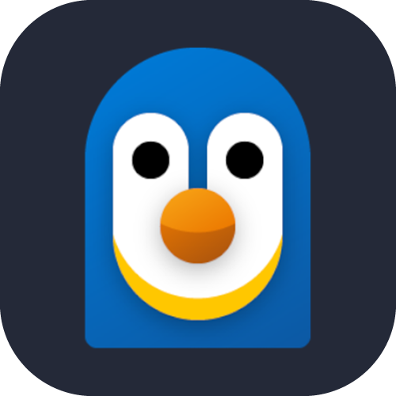
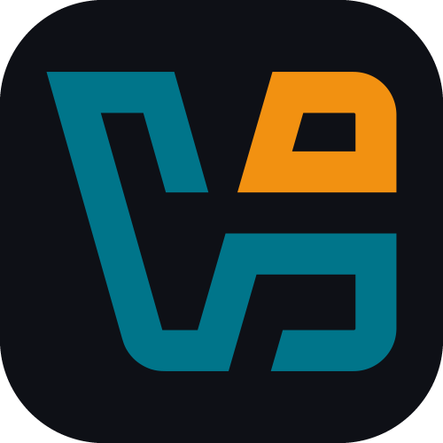
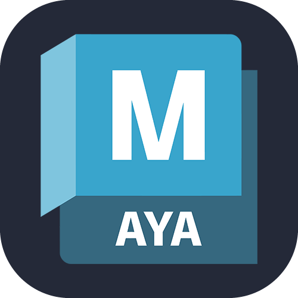
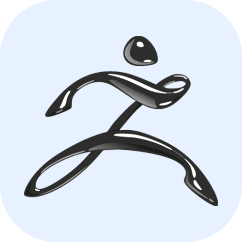

# Pablo Fuentes Soto (PabloDesk)

   <!--<a href="pablodesk1024@gmail.com"> 📧 pablodesk1024@gmail.com</a>
  &nbsp;·&nbsp; -->
  <a href="https://pablodesk.github.io/CV_PabloDesk/"> 🌎 PabloDesk Webside 🌎</a>
  &nbsp;  <!--·&nbsp;
  <a href="https://pablodesk.github.io/CV_PabloDesk/"> 🗽 English Version </a>  -->

### 🚀 Sobre mí

Soy un **Animador Digital** con visión artística y comunicacional en plena transición hacia la **Ingeniería en Informática**.  
Mi objetivo es alcanzar la excelencia técnica para desarrollar proyectos que generen un impacto real y positivo en las personas.

### 👀 ¿En qué ando ahora?

🔭 Actualmente dando mis primeros pasos en programación y lógica de software.  
🌱 Estudiante de Full Stack Java en [Generation Chile](https://chile.generation.org/)  
💬 **Pregúntame sobre**: **Animación, Modelado 3D y Game Design.**  
⚡ **Dato curioso**: Creo que el código es otra forma de arte, solo que con una sintaxis más estricta.  

---

### 🛠️ Stack Profile

| 🎨 Front-End | ⚙️ Back-End |
| :---: | :---: |
|  | 

#### ☁️ Cloud & DevOps
 &nbsp; &nbsp;

#### 🛠️ Tools & IDEs
 

#### 👾 Game Engines & IA 
 &nbsp;  &nbsp; 

#### 🪄 Modeling, Design and Video Editing
 &nbsp; &nbsp; &nbsp;

  <!-- -->

---

### 🏆 Achievements

---

### 📫 Conectemos

  

<!--
**PabloDesk/PabloDesk** is a ✨ _special_ ✨ repository because its `README.md` (this file) appears on your GitHub profile.

Here are some ideas to get you started:

- 🔭 I’m currently working on ...
- 🌱 I’m currently learning ...
- 👯 I’m looking to collaborate on ...
- 🤔 I’m looking for help with ...
- 💬 Ask me about ...
- 📫 How to reach me: ...
- 😄 Pronouns: ...
- ⚡ Fun fact: ...
-->
