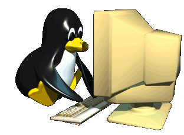

# ¡Hola! Soy Pablo Fuentes Soto (PabloDesk)👋
💻🐀 [3D Character and Prop Modeler | 3D Animator | Entusiasta en Programación]

---

## ⚙️ Software & Workflow

### 🐧 Sistemas & DevOps
 &nbsp;  &nbsp; 

### 📄 Front-End
 &nbsp; 

### 💻 Programación
 &nbsp; 

### 👾 Game Engines & IA
 &nbsp;  &nbsp;  &nbsp; 

### 🎨 Diseño, Modelado y Renderizado
 &nbsp;  &nbsp; 

## 🚀 Sobre mí

- 🔭 Actualmente estoy aprendiendo **Java y Javascript**.
- 🌱 Estoy transaccionando de carrera para ser ingeniero en informática.
- 💬 Pregúntame sobre: Animación y Modelado 3D.
- ⚡ Dato curioso: Me encanta aprender cosas nuevas.

---

## 📫 Contactos
Puedes encontrarme en:

  

<!--
**PabloDesk/PabloDesk** is a ✨ _special_ ✨ repository because its `README.md` (this file) appears on your GitHub profile.

Here are some ideas to get you started:

- 🔭 I’m currently working on ...
- 🌱 I’m currently learning ...
- 👯 I’m looking to collaborate on ...
- 🤔 I’m looking for help with ...
- 💬 Ask me about ...
- 📫 How to reach me: ...
- 😄 Pronouns: ...
- ⚡ Fun fact: ...
-->
